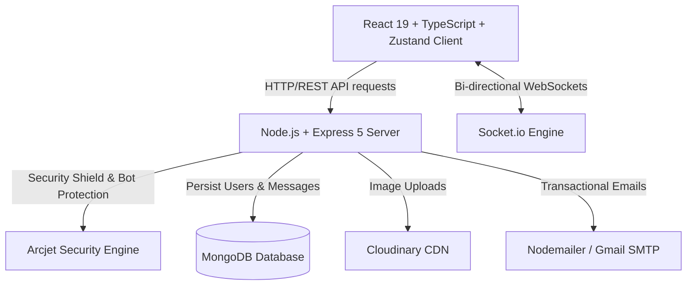

<div align="center">


# Whispr 💬⚡

> **Whispr** is a modern, ultra-fast, and secure full-stack real-time web chat application engineered with Node.js, Express, Socket.io, MongoDB, React 19, TypeScript, and Zustand. 

[](https://whispr-7h13.onrender.com/)

> 🚀 **Live Demo:** [https://whispr-7h13.onrender.com/](https://whispr-7h13.onrender.com/)  
> ⏳ *Note: Deployed on Render free tier. If the instance is idle, the initial load may take 30–50 seconds while the backend container wakes up.*

<br/>

[](https://react.dev/)
[](https://www.typescriptlang.org/)
[](https://nodejs.org/)
[](https://socket.io/)
[](https://www.mongodb.com/)
[](https://tailwindcss.com/)

</div>

---

## 🧠 Engineering Highlights (Why Whispr?)

Whispr was built to demonstrate proficiency in handling complex, real-time data flows while maintaining strict security and a premium user experience.

- **State Management Mastery:** Utilizes Zustand for lightweight, boilerplate-free state management, cleanly separating UI from complex WebSocket logic.
- **Security First:** Integrates Arcjet to proactively defend against bots and rate-limit abuse, alongside standard JWT `httpOnly` cookie authentication.
- **Scalable Foundation:** The monorepo structure and separation of concerns (Controllers, Middlewares, Libs) prepare the codebase for seamless scaling and team collaboration.
- **Attention to Detail:** From the custom mechanical keystroke sounds to the pixel-perfect Tailwind layouts, Whispr focuses on delivering a production-ready feel.

---

## ✨ Executive Highlights & Key Features

Whispr is built to deliver a premium, production-grade messaging experience inspired by platforms like WhatsApp and Telegram.

- ⚡ **Instant Messaging**: Real-time bi-directional messaging with zero dynamic page reloads via Socket.io.
- 🟢 **Live Presence & Multi-Device Support**: Multi-socket mapping per user allowing tracking of online status and persisting last active timestamps automatically upon disconnect.
- 🖼️ **Rich Media Sharing**: Seamless image uploading powered by Cloudinary CDN with real-time dynamic previews.
- 🔐 **Robust Authentication**: Cookie-based JWT authentication (`httpOnly`, `sameSite: strict`, `secure`) with password hashing via bcryptjs.
- 🛡️ **Enterprise Security (Arcjet Protection)**: Integrated Arcjet shield middleware featuring rate limiting, automated bot detection, and spoofed bot detection.
- 🔊 **Interactive Soundscapes**: Custom auditory feedback including randomized mechanical keyboard typing audio effects and incoming notification chimes.
- 📧 **Transactional Email Workflow**: Automated HTML email dispatches (Welcome emails on signup & Security alert emails on new sign-ins) powered by Nodemailer.
- 🎨 **Modern WhatsApp-Inspired UI**: Responsive, pixel-perfect UI designed with custom warm palettes (`#EDE7DD`, `#0F3D2E`, `#22C55E`), group date separators, custom scrollbars, and seamless mobile toggle modes.

---

## 🏗️ System Architecture & Data Flow



---

## 🛠️ Tech Stack & Ecosystem

### Frontend (`whispr-client`)
- **Core Framework**: React 19, TypeScript, Vite 8
- **State Management**: Zustand 5
- **Routing**: React Router 7
- **Styling**: Tailwind CSS v4, Lucide/Heroicons React Icons
- **HTTP & WebSockets**: Axios (with credentials), Socket.io Client
- **Audio Feedback**: Web Audio API / HTML5 Audio

### Backend (`whispr-server`)
- **Runtime & Server**: Node.js, Express 5
- **Real-Time Engine**: Socket.io 4 (with Cookie Middleware authentication)
- **Database**: MongoDB with Mongoose ORM
- **Authentication**: JSON Web Tokens (JWT), BcryptJS
- **Security & Bot Detection**: Arcjet Security Engine (`@arcjet/node`, `@arcjet/inspect`)
- **Cloud Media**: Cloudinary SDK
- **Email Dispatcher**: Nodemailer

---

## 📁 Repository Structure

```
Whispr/
├── package.json               # Root scripts for mono-build & orchestration
├── whispr-client/             # React 19 Frontend Application
│   ├── src/
│   │   ├── assets/            # Audio files & static media assets
│   │   ├── components/        # React components (Chat, Sidebar, Auth, Landing)
│   │   ├── lib/               # Zustand stores, Axios instance, Sound utilities
│   │   ├── App.tsx            # Main router & auth lifecycle
│   │   └── main.tsx           # Client entry point
│   └── package.json
└── whispr-server/             # Node.js Express Backend & WebSockets
    ├── src/
    │   ├── controllers/       # Auth & Message controllers
    │   ├── lib/               # Socket server, DB, Cloudinary, Email, Arcjet configs
    │   ├── middlewares/       # JWT Auth, Socket auth, Arcjet protection
    │   ├── models/            # Mongoose User & Message schemas
    │   ├── routes/            # REST API routes
    │   └── server.js          # App bootstrapper
    └── package.json
```

---

## 🚀 Quick Start & Installation

### Prerequisites
- **Node.js** (v18.x or higher)
- **MongoDB** instance (Local or MongoDB Atlas)
- **Cloudinary** account credentials
- **Gmail App Password** (for Nodemailer transactional emails)

### 1. Clone the repository
```bash
git clone https://github.com/Rakib-dhali/whispr.git
cd Whispr
```

### 2. Configure Environment Variables

Create `.env` inside `whispr-server/`:
```env
PORT=3000
MONGODB_URI=mongodb+srv://<username>:<password>@cluster.mongodb.net/whispr
JWT_SECRET=your_super_secret_jwt_key
CLIENT_URL=http://localhost:5173
NODE_ENV=development

# Cloudinary Setup
CLOUDINARY_CLOUD_NAME=your_cloud_name
CLOUDINARY_API_KEY=your_api_key
CLOUDINARY_API_SECRET=your_api_secret

# Email Service
EMAIL_USER=your_email@gmail.com
EMAIL_PASS=your_gmail_app_password
EMAIL_FROM=Whispr <your_email@gmail.com>

# Security Shield (Arcjet)
ARCJET_KEY=ajkey_your_arcjet_key
```

Create `.env` inside `whispr-client/`:
```env
VITE_API_URL=http://localhost:3000
```

### 3. Install Dependencies & Run Locally

Using the root monorepo scripts:

```bash
# Install all dependencies across client and server
npm run build

# Start server (runs on port 3000)
npm run start
```

Or run dev environments independently:

```bash
# Terminal 1: Backend
cd whispr-server
npm run dev

# Terminal 2: Frontend
cd whispr-client
npm run dev
```

Open `http://localhost:5173` in your browser to experience Whispr!

---

## 🧪 Testing Real-Time Messaging Locally

1. Open two browser windows (or one standard and one incognito window).
2. Register two different user accounts (e.g. `Alice` and `Bob`).
3. Select `Bob` on `Alice`'s contact list.
4. Send a text or upload an image—observe instant deliverability, badge status, keystroke sounds, and instant update on `Bob`'s screen!

---

## 🤝 Contributing

Contributions, issues, and feature requests are welcome! Feel free to check the issues page.

---

## 📜 License

Distributed under the ISC License. See `LICENSE` for details.
